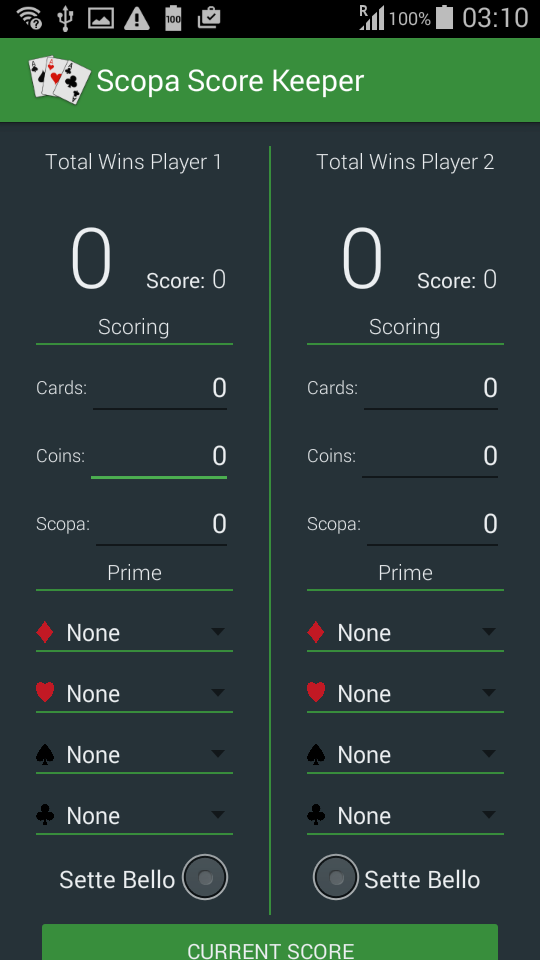
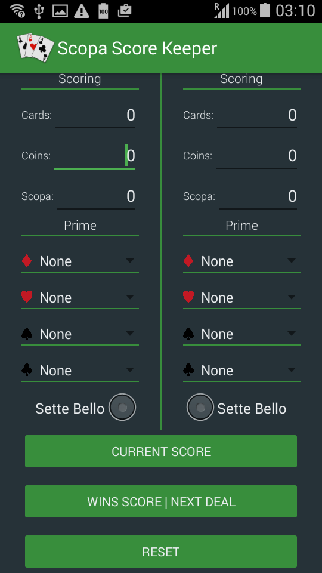
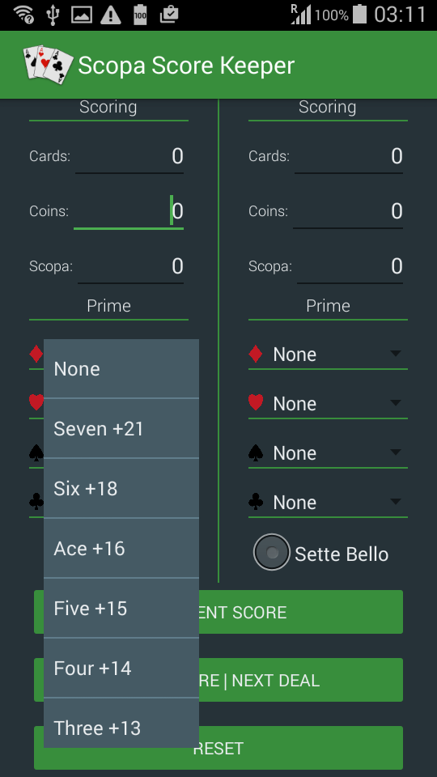
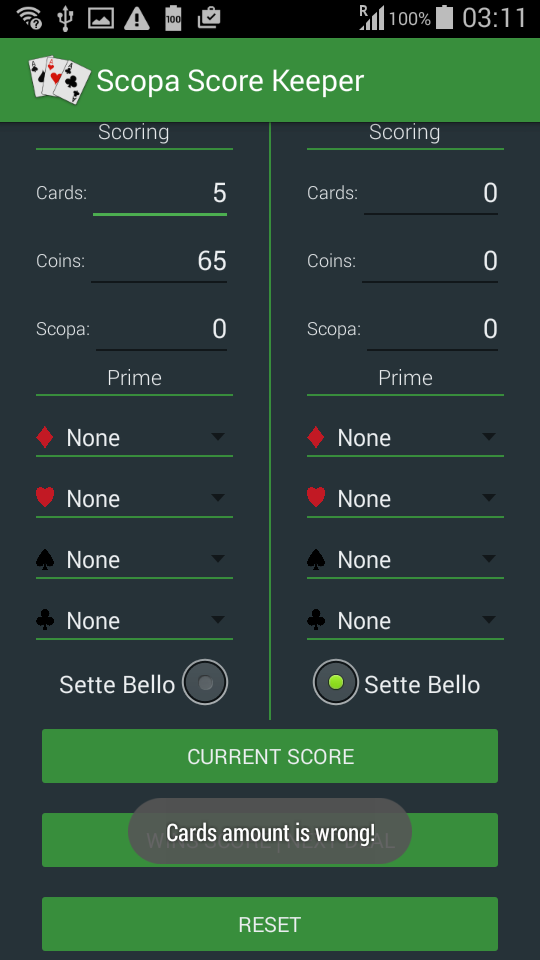
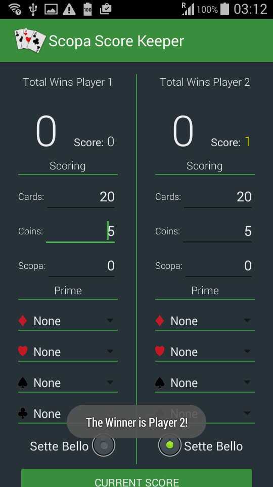
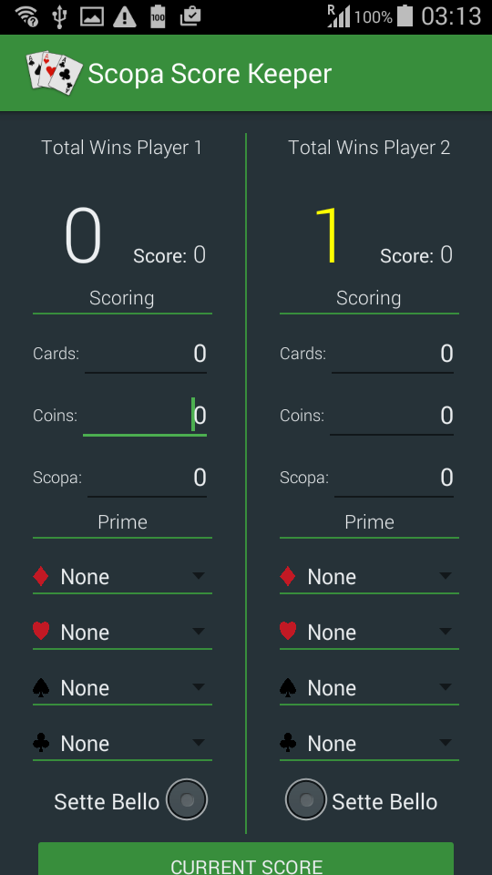
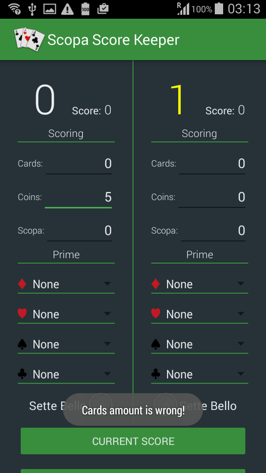
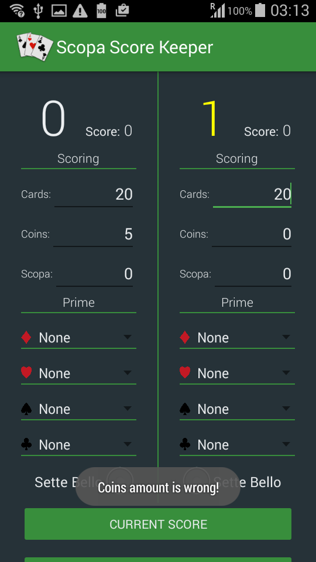
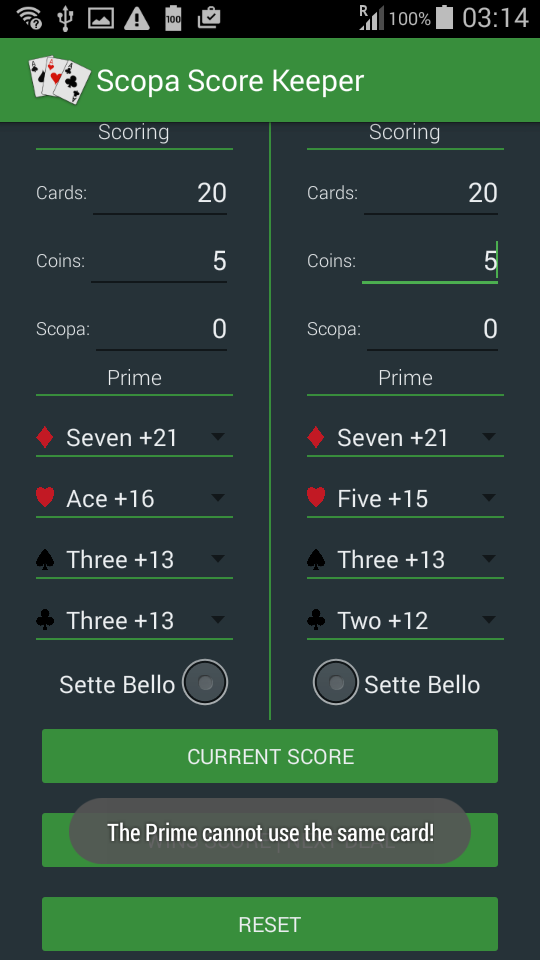

Here there is an app that I made for the second project "Court Counter App" of the course "Android for Beginners".

So I decide some of unique that was not already published on udacity forum. I was inspirated at the famous italian cards game, named "Scopa".

Here you can find more detail about this game:
https://en.wikipedia.org/wiki/Scopa

I have used the french symbols, because are easier to find card with it.

This app is complete and works without any error. Here some screenshot:

  
  

In addition it has a lot of functions. As scrolling due to high number of functions, inputs as EditText, where you can add directly the number from the keyboard before of calculating the score of the deal. Then it have several spinner with a drop menu, where it is possible easly choose the right card that you need.

  

The radiobutton that allow of choosing only one option, because the card "Sette Bello" is unique and only one player can have it and provides a complete system able to check error of inputs, showed as toast popup messages:

  
  
  
  
  
  

With the button "Current score" you can calculate the points got in the current deal. This will update the small number, nearby at score. The player with the higher score will be shown with a yellow color and a toast message will say the winner of this deal. When the you will touch the "wins score | next deal" the app update the big number that show the wins score and. If yellow is the higher.

  

I hope you like this app and you will find it useful.

Please give me your feedback for any improvement or any issue or if have question I will happy to help you.

https://discussions.udacity.com/t/scopa-score-keeper-app-with-message-popup-spinner-radiobutton-and-edittext/238218
